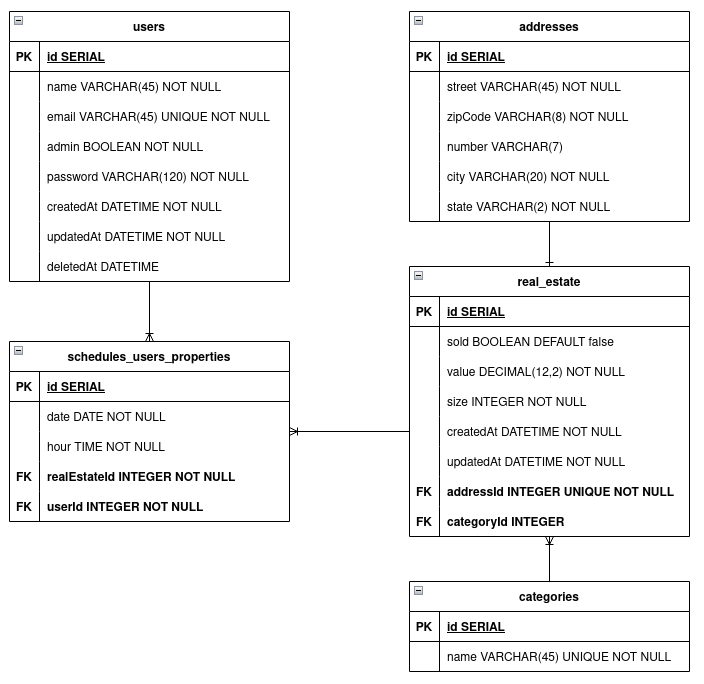

<<<<<<< HEAD
# G-IMOVEIS
=======
# 🏁 G-Imóveis - TypeORM com Relacionamentos

Este projeto trata-se de um serviço de back-end responsável por gerenciar uma imobiliária utilizando Node.JS e TypeScript desenvolvido por mim durante o curso de desenvolvimento web full-stack da Kenzie Academy Brasil porém os testes rodados nele foram desenvolvidos pelos professores da Kenzie para avaliar o projeto.

## Principais Linguagens e Tecnologias Utilizadas

- **Node.js:** Plataforma de desenvolvimento para construção de aplicações backend utilizando JavaScript.
- **TypeScript:** Linguagem de programação que adiciona tipagem estática ao JavaScript, proporcionando melhor escalabilidade e manutenibilidade ao código.

## Dependências Principais

- **@types/bcryptjs (v2.4.2):** Tipos TypeScript para a biblioteca bcryptjs, utilizada para criptografar senhas de forma segura.
- **bcryptjs (v2.4.3):** Biblioteca para realizar hash de senhas de maneira segura.
- **dotenv (v16.0.3):** Utilizada para carregar variáveis de ambiente de um arquivo .env para o processo Node.js.
- **express (v4.18.2):** Framework web para Node.js, facilitando o desenvolvimento de aplicativos web.
- **express-async-errors (v3.1.1):** Pacote para simplificar o tratamento de erros assíncronos no Express.
- **jsonwebtoken (v9.0.0):** Biblioteca para gerar e verificar JSON Web Tokens (JWT), comumente usada para autenticação.
- **pg (v8.9.0):** Driver PostgreSQL para Node.js, permitindo a conexão com bancos de dados PostgreSQL.
- **reflect-metadata (v0.1.13):** Biblioteca que adiciona suporte a metadados para reflexão em tempo de execução no TypeScript.
- **typeorm (v0.3.11):** ORM para Node.js e TypeScript, facilitando a interação com bancos de dados relacionais.
- **zod (v3.20.6):** Biblioteca de validação de esquemas para TypeScript, usada para garantir a integridade dos dados.




Para inciar este projeto, é necessário instalar as dependências, que serão utilizadas nos testes. Portanto utilize o comando abaixo para instalar tais dependências:

```bash
# caso use npm
npm run i

# caso use yarn
yarn
```

## Instalação

Apenas as bibliotecas de teste, ou que os testes dependem, estão no **package.json**. Por isso, instale as dependências do projeto manualmente e não se esqueça de inicia-lo também.

```bash
# caso use npm
npm init -y

# caso use yarn
yarn init -y
```

## Rodando os testes

Para rodar os testes é necessário que no seu terminal, você esteja dentro do diretório do projeto.

Estando no terminal e dentro do caminho correto, você poderá utilizar os comandos a seguir:

### Rodar todos os testes

```bash
# caso use npm
npm run test

# caso use yarn
yarn test
```

>>>>>>> 44566b96a33f984288961dbfb255e9f3887c2af3
